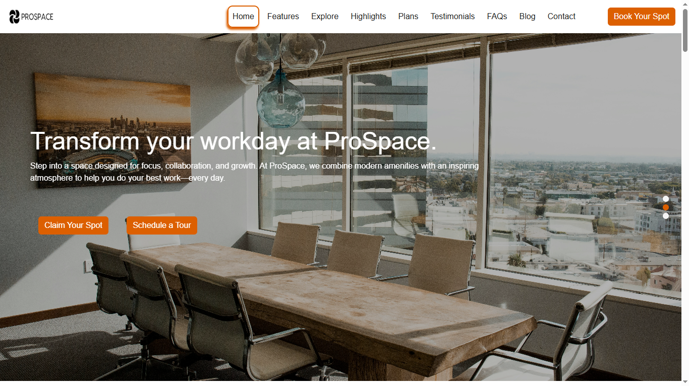
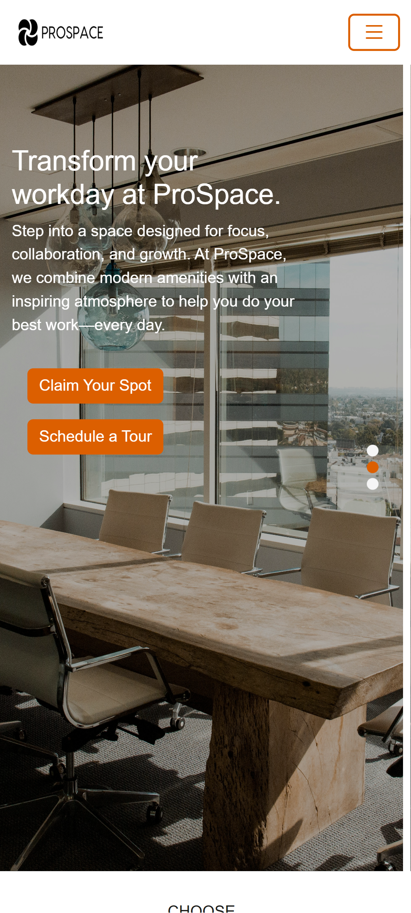

# 🏢 ProSpace — Co-working Landing Page

    


A modern, responsive landing page for **ProSpace**, a fictional co-working space provider. This project was built from scratch using **HTML**, **CSS**, **JavaScript**, and CSS framework like **Bootstrap**, implemented using self-directed layout decisions and design judgment without relying on third-party design files.It highlights front-end layout techniques, responsive design principles, use of Bootstrap’s interactive elements and and dynamic content presentation using **Swiper** (a JavaScript library for sliders and carousels).


## 📸 Preview

<p align="center">
  
  
  
</p>


## 🚀 Live Demo

🌐 [View Live ](https://sam8284.github.io/bootstrap-cowork-landing/)


## 🎯 Purpose

The purpose of this project is to demonstrate the ability to independently design and develop a modern, responsive landing page using front-end technologies — without relying on pre-built UI designs or mockups. It also showcases skills in layout planning, responsive frameworks, and integrating interactive libraries like Swiper.


## 🛠 Tech Stack

-  HTML5  
  
-  CSS3  
-  JavaScript  
-  Bootstrap  
-  Swiper


## ✨ Features

✅ Custom hero vertical swiper with headline and CTA<br>
✅ Features, Plans, FAQs, Blog sections with responsive layout<br>
✅ Interactive Explore section image slider using Swiper<br>
✅ Responsive navbar and mobile-first design with Bootstrap<br>
✅ Smooth hover effects and modern UI styling<br>
✅ Scroll-triggered animations and transitions<br>
✅ Contact form and footer with social links<br>
✅ No Figma or design file used — self-designed UI/UX<br>


## 🧰 Materials Used
- **Swiper**: A modern JavaScript library for creating responsive, touch-enabled sliders and carousels.
- **Bootstrap**: A popular front-end framework for building responsive and mobile-first websites using prebuilt CSS and JavaScript components.
- **Bootstrap Icons**: Free, high quality, open source icon library


## 🧩 Project Structure


``` 
/ 
├── assets/ 
│   └── desktop.png 
│   └── mobile.png 
│   └── tablet.png 
├── banner/ 
│   └── banner 1.jpg 
│   └── banner 2.jpg 
│   └── banner 3.jpg 
├── blog/ 
│   └── blog 1.jpg 
│   └── blog 2.jpg 
│   └── blog 3.jpg 
├── explore/ 
│   └── img 1.jpg 
│   └── img 2.jpg 
│   └── img 3.jpg 
│   └── img 4.jpg 
├── images/ 
│   └── fevicon.png 
│   └── image.jpg 
│   └── logo.PNG 
├── testimonials/ 
│   └── profile 1.jpg
│   └── profile 2.jpg
│   └── profile 3.jpg
│   └── profile 4.jpg
│   └── profile 5.jpg
├── fonts/ 
│       └── Raleway-VariableFont_wght.woff2
├── index.html 
├── style.css 
├── main.js 
├── package-lock.json 
├── package.json 
└── README.md 
``` 


## 📦 Installation / Usage

1. Clone the repository 

```bash
git clone https://github.com/sam8284/bootstrap-cowork-landing.git
```

2. Navigate to the project directory

```bash
cd bootstrap-cowork-landing
```

3. Run the App:
- Open the index.html file in your browser or use a live server (like VS Code Live Server extension) for better development experience.

```bash
open index.html
```
### Note:
✅ No build tools or dependencies needed.


 ## 📋 Future Enhancements
- Backend integration for contact form (e.g., with PHP or Firebase)
- Booking system with real-time availability
- Admin dashboard for space management
- Blog or event section


## 📬 Contact


[](mailto:saima.ansari8811@gmail.com?subject=Hello&body=I%20found%20your%20project%20interesting!)

[](https://www.linkedin.com/in/saima-ansari-dev/)

## 📄 License

This project is licensed under the MIT License. See the [MIT LICENSE](./LICENSE) file for more information.


## 🤝 Acknowledgements

- [Bootstrap](https://getbootstrap.com/) for CSS framework
- [Bootstrap Icons](https://icons.getbootstrap.com/) for icons
- [Google Fonts](https://fonts.google.com/) for fonts
- [Swiper](https://swiperjs.com/) for carousel
- [Unsplash](https://unsplash.com/) for demo images

